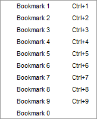

# 编辑 TeX 文档

## 创建新文档

以下小节描述了创建新文档的两种不同方式：

### 设置 TeX 文档的导言区

要定义文档的导言区（preamble），您可以使用`快速开始`向导（`Wizard`菜单）。


此对话框允许您设置文档的主要特性（类别、纸张大小、编码（encoding）等）。
注意：您可以通过点击`+`按钮添加其他选项。所有设置都会被记录。

<!--
您也可以在编辑器中键入自己的导言区模板：使用“复制/粘贴”或“另存为”命令，您可以在新文档中使用它。
-->


### 使用模板开始新文档

对于新文档，可以通过使用命令`文件/从模板新建`来使用模板。一个对话框会显示一系列模板。


您可以从模板创建一个新的文档（暂未指定保存路径），或者在磁盘上创建文档并在编辑器中打开这些文档。
对于多文件模板（multi-file templates）（例如，内置的Book模板），前一种方式不可用。

在已经打开的文档中，通过使用`文件/制作模板`命令，可以将此文档创建为一个新模板。
请注意，这个对话框目前不支持模板系统的全部功能。特别是，您无法提供预览图像（preview image）或使用它创建多文件模板。您需要手动进行设置（参见下面的[模板格式](background.md#the-document-template-format)）。

用户添加的模板可以通过在模板选择对话框中使用上下文菜单（context menu，即通过鼠标邮件跳出的小菜单）进行编辑或删除。

内置模板无法修改。

用户模板保存在配置目录的 `/templates/user/` 子目录中。

## 结构化您的文档

要在您的文档中定义新的部分（部分、章节、小节等），只需在主工具栏（main toolbar）的格式工具栏（format toolbar）中使用这个组合框（combo box）按钮：


## 浏览您的文档

### 结构视图

“结构视图（Structure View）”（左侧的面板）可以让您快速访问文档的任何部分。

只需点击任何项（item）（例如，标签label、章节section等），您就会被带到编辑器中相应区域的开头。

<!-- 
跳转到行的机制不再只考虑行号，而是真正记住文本行。因此，添加和删除行不会导致跳转到错误的位置。lai: 没必要写
-->

在结构视图中，蓝色背景显示了文档中当前光标位置。

绿色背景表示位于附录中的章节。


结构视图会随着您的输入自动更新。您也可以随时使用`刷新结构（Refresh Structure）`（菜单`Idefix`）命令。

结构视图显示标签、章节、包含项（includes）、beamer块和待办事项（todos）。

待办事项有两种类型：

1. todo-like command，例如，来自包 `todonotes` 的 \\todo{}。

2. todo-comments：这是一个以`%TODO`或`%todo`为开头的评论。参见下面的[TODO 评论的正则表达式](#TODO 评论的正则表达式)）。

结构视图还提供了一个上下文菜单，允许您：

- 自动创建章节的标签

- 复制/剪切属于某个章节的所有文本（包括子章节），并在章节之前或之后粘贴。
- 章节可以进行缩进/取消缩进（indented/unindented），这意味着层次级别（hierarchy level）变化了一个。例如，\section 进行缩进变为 \\subsection，并且所有子章节也相应地处理。

### TODO 评论的正则表达式

<!-- 
lai: 新添加的内容
-->

设置其他评论被标记为待办事项评论的正则表达式（regular expression）。

您可以在`选项/高级编辑器/TODO 评论的正则表达式` （作为前提，你需要在选项窗口的左下角勾选`Show Advanced Options`之后才能出现）中设置TODO 评论的正则表达式（regular expression）。


默认为正则表达式 `%\s*(TODO|todo)` ，用于匹配代码中的 TODO 或 todo 注释。以下是对这个正则表达式的解释：

- **`%`**：这部分是匹配 `%` 符号的字面字符。在latex语法中， `%` 符号通常用于表示注释的起始。

- **`\s*`**：这部分表示匹配零个或多个空白字符。`\s` 表示空白字符，包括空格、制表符和换行符。`*` 表示匹配前面的模式零次或多次，因此 `\s*` 允许在 `%` 符号之后有任意数量的空白字符。

- **`(TODO|todo)`**：这是一个括号内的分组，用于匹配 TODO 或 todo 中的任何一个。大小写敏感。

例如，以下注释都会被匹配：

- `% TODO: 这是一个待办事项注释`
- `%todo 修复此错误`
- `%     todo 优化性能`
- `%todo`
- `% TODO`

这个正则表达式非常适合在代码中寻找并标记待办事项注释，以便开发者和团队能够识别和处理未完成的任务。

你还可以将todo评论设置为`%\s?[A-Z][A-Z_-]+`，用于任何以至少两个大写字母开头的评论。

### 目录（TOC）视图

左侧的侧面板提供了一个目录（TOC）视图。目录显示了整个文档的结构，通过 section commands (part, section, subsection,...) 来实现。

鼠标悬停（mouse over）时会显示该章节实际位于哪个文件中。


上图展示了这样的情况：
一个名为document.tex的根文件包含了名为file1.tex的文件。根文件中包含“主文本”这一节，而file1.tex文件包含名为“外部”的小节。
将鼠标指针悬停在目录视图的这个小节上时，可以在鼠标悬停处找到文件名file1.tex。即使文件未打开，此功能也有效（但文档必须由TeXstudio加载，参见编辑器设置中的自动加载包含的文件（Automatically load included files））。
此时，在目录中点击该小节，将为您打开文件。

请注意，不同文件的章节会显示不同程度的绿色阴影，深绿浅绿相间出现以作区分。

有时，被包含的文件中可能没有任何章节。那么文件名本身会出现在目录中（不带文件扩展名）。如下图所示：


现在，鼠标悬停会显示包含该文件的文件名，即 file1.tex（也就是 document.tex）。
缩进显示 file1.tex 的文本是“主文本”部分的一部分。

您可能希望在配置对话框中选择不同的颜色（参见[高级编辑器设置](configuration.md#configuring-the-advanced-editor-settings-advanced-option)中的选项“在全局目录中使用颜色”）。

### 使用书签

您可以在 TeXstudio 的编辑器中使用书签（Bookmarks）。这有助于记住文本行（text lines）并加快在它们之间的导航。

在编辑器文本区域的左侧有一个显示书签图标的书签栏。
在这里，您可以打开一个上下文菜单（见下方图片）并选择要为文本行设置的书签。
十个编号的书签中的每一个只能使用一次（如果在同一编辑器中第二次设置，则会删除第一个），而未命名的书签可以多次使用。

您还可以使用菜单中的第一个选项删除书签。

更快设置书签的方法是在书签栏中用左键点击，TeXstudio 将选择一个书签或删除已有的。


您可以选择左侧面板中的书签视图，它显示了所有编辑器中带有书签的每行文本。

通过鼠标点击，您可以跳转到编辑器中的文本行。

提示框（tooltip）（即鼠标悬停）会显示该行周围的上下文（见下方左图）。

这些行按照您创建书签的顺序排列。

上下文菜单允许您更改行的顺序或删除书签（见下方右图）。

 

您可能已经注意到了 TeXstudio 窗口右下角状态栏（status line）上的三个按钮（看起来像书签1、2和3，见上面的书签图片）。

点击这些按钮，您可以跳转到当前编辑器中相应的书签。

实际上，这是您可以在菜单`编辑/转到书签(Edit/Goto Bookmark)`中找到的操作的一部分，如下图中中间所示。该菜单还会显示您可以使用的快捷键。

从`编辑/转到(Edit/Go)`菜单中，您可以选择跳转到给定行号的行。您可能想使用上一个标记或下一个标记来查找未命名的书签。

为了完整起见，应该说书签是几种类型的标记之一（见[日志文件](compiling.md#the-log-files)）。

您可以使用菜单`编辑/切换书签(Edit/Toggle)`中的操作来切换（toggle）带有文本光标的行的书签，如下图右侧所示。

  

## 格式化您的文本

您可以使用中央工具栏的格式部分快速设置文本的部分格式。
更多选项可在“LaTeX”菜单中找到。常用的格式化命令如 `\textbf` 也可以作为快捷方式使用，这里是 `CTRL+B`。


```{note}
选定文本可以直接被某些环境所包围。例如：在选中单词“Hello”后，点击“加粗”按钮或按下 `CTRL+B`，您将得到代码：`\textbf{Hello}`。
```
