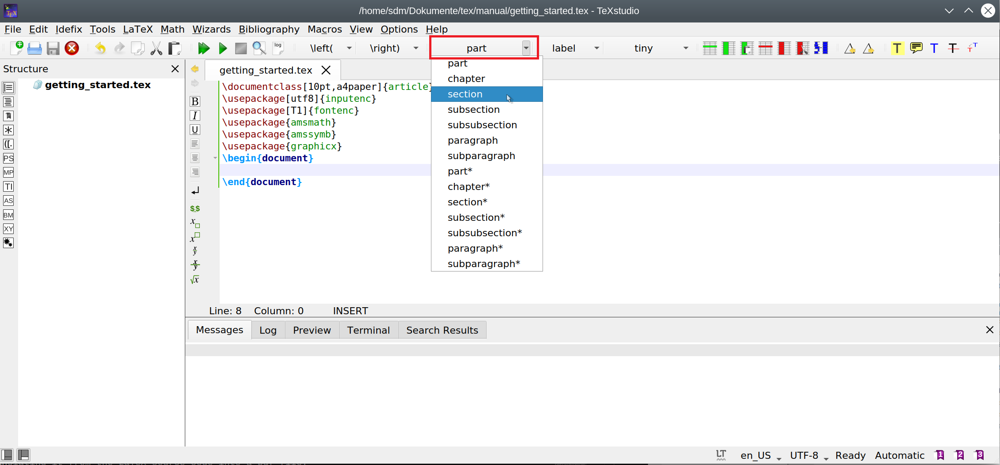
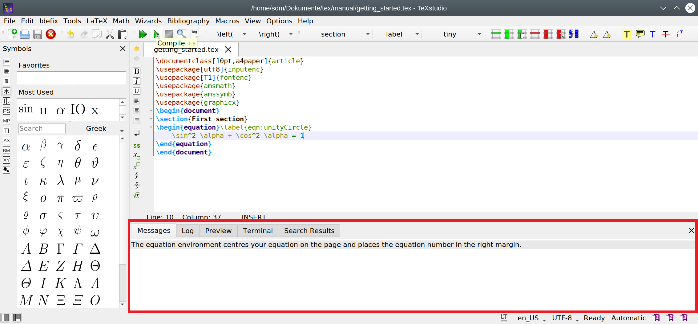

# 入门

## 要求
TeXstudio 是一个专门的 LaTeX 编辑器。它通过帮助找到正确的命令、支持错误分析以及提供查看结果的简便方式，使得输入[LaTeX 文档](https://www.latex-project.org/about/)更加舒适。

实际的 LaTeX 系统需要[单独安装](https://www.latex-project.org/get/)，并且**不**由 TeXstudio 提供。这里我们假设你的系统上已经安装了 TeXstudio 和 LaTeX 系统。

## 启动 TeXstudio
<!--
This needs to be refined；缺少format，table的说明
-->


在左侧我们有 *侧面板（side panel）*，目前显示的是一个空的结构视图（structure view）。

在右下角，你可以看到 *消息面板（messages panel）*，它可以切换到 [*日志面板*](compiling.md#the-log-files)、*预览面板（preview panel）* 或 *搜索结果面板（search results panel）*。

*工具栏（toolbar）*方便地访问一些常用功能，其中三个我们很快会使用。

*中央工具栏（central toolbar）*提供了一些常见 LaTeX 命令的访问，我们将会看到。


## 创建第一个文档
LaTeX 需要在文档中一些配置代码。[快速开始向导（Quick Start Wizard）](editing.md#setting-the-preamble-of-a-tex-document) 提供了一种设置典型文档的简单方法。


菜单选择 `Wizards/Quick Start...` 并用 `OK` 确认对话框。这将生成如下基本文档：

```latex
    \documentclass[10pt,a4paper]{article}
    \usepackage[T1]{fontenc}
    \usepackage{graphicx}
    \usepackage{mathtools}
    \usepackage{amssymb}
    \usepackage{amsthm}
    \usepackage{thmtools}
    \usepackage{xcolor}
    \usepackage{nameref}
    \usepackage{hyperref}
    \begin{document}
		
    \end{document}
```
我们不会详细地讨论文档的内容，因为我们的重点是LaTeX 编辑器，而这是本教程的内容。

文件需要保存在计算机上才能发挥作用。因此，接下来我们点击保存按钮（或使用 `CTRL+S`），并用像 "getting_started.tex" 这样合理的名称保存它。

## 填写内容
### 插入章节
我们可以从章节按钮中选择 `\section`，以插入章节命令并添加标题文本；或者我们可以通过菜单 `Latex/Sectioning/` 以插入章节命令。



### 插入方程环境
我们可以通过菜单 `Math/Math equations/env equation` 或按 `CTRL+SHIFT+N` 来插入方程环境。


### 插入符号
LaTeX 提供了大量的数学和其他符号。使用左侧的符号面板选择合适的符号是一种方便的方法。符号可以被声明为收藏（favorites）（通过鼠标右键弹出小菜单），并且最常用的符号也被收集起来，以便于更快的导航。


## 编译
编译文档意味着将其从 LaTeX 源代码转换为 pdf 文件。这可以通过点击 *编译（Compile）*按钮或使用键 `F6` 来执行。



这将调用实际的 LaTeX 系统（默认为 pdflatex）来编译磁盘上的文档。消息面板显示了该运行的结果，并且在出现错误时会跳转到[日志视图（log-view）](compiling.md#the-log-files)。

## 查看您的 PDF 文档
现在我们想要查看结果。为此，请点击*查看（view）*按钮或按下 `F7`。


PDF 文档显示在 TeXstudio 中文本的右侧。您可以滚动（scroll）和缩放（zoom）来检查结果。

小技巧：在 PDF 中的文本或图片上 `CTRL+左键点击` 将跳转到相应的源代码。

按下 `F7` 或点击查看按钮实际上会将 PDF 滚动到文档中光标（cursor）所在源文档的同一位置，详情请见[这里](viewing.md#forward-and-inverse-searching)。

<!--
label/ref
navigation (structure)
insert commands
completer
syntax check
-->
